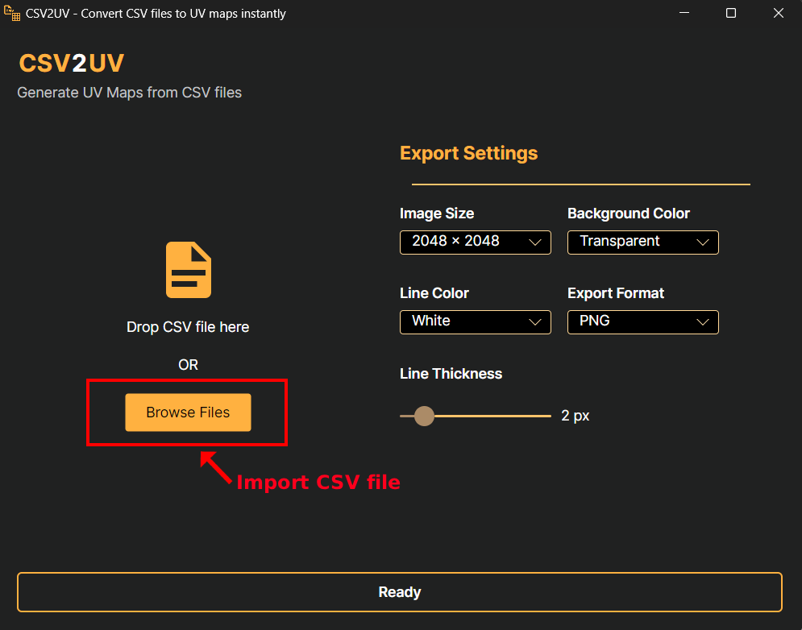
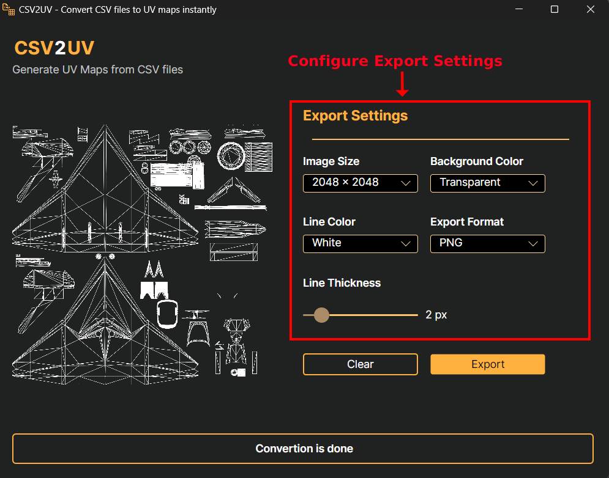
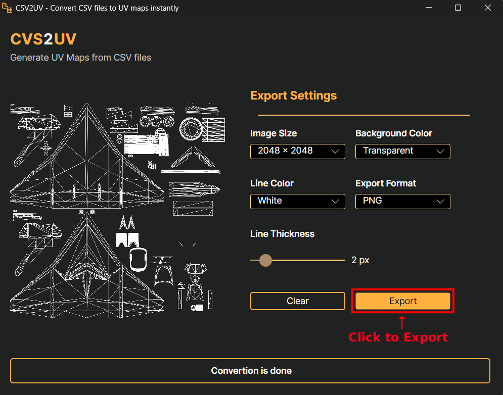
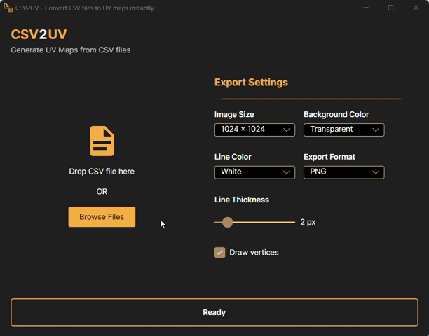
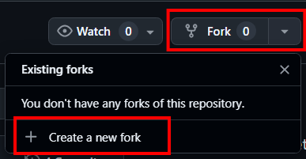

# CSV2UV - Utility Software for Converting CSV files from DCS into UV maps.

SV2UV converts DCS ModelViewer2 exported CSV UV data (the UV to file export) directly into image UV maps so you can create liveries without using Blender. 

This project is based on and inspired by Ettenmure’s [dcs-uv-converter](https://github.com/Ettenmure/dcs-uv-converter/) (which used a Blender add-on). You must attribute Ettenmure for the original approach; CSV2UV reimplements and extends that idea in C# .NET Core and adds features you need.

## Features

- Adjustable line thickness. 
- Selectable line color. 
- Selectable background color. 
- Selectable output image size. 
- Selectable output format (PNG, BMP, JPG, WEBP).

## v1.1.0  
### Introduced a new set of features

- 8192px export size is now supported.  
- Drawing vertices is now optional.  
- The export folder can now be opened directly after export.

## Prerequities
- Windows (recommended) or any OS that can run .NET Core/.NET 8+ executables
- [.Net 8.0](https://dotnet.microsoft.com/en-us/download/dotnet/8.0)

## Installation

1. Download the latest release from the Releases tab 
- Choose CSV2UV.exe if you already have the .Net 8.0 installed
- Choose zipped version if you don't have the .Net 8.0 installed

1. Unzip (if applicable).

1. Run the executable: double-click CSV2UV.exe 

If you downloaded CSV2UV.exe version, install the appropriate [.NET runtime](https://dotnet.microsoft.com/en-us/download/dotnet/8.0) from Microsoft before running.

## Usage

### Import CSV File

### Adjust Export Settings

### Export Image

### Demo


## Note for Developers
- Language: C# (.NET Core / .NET 8+)

### How to Build Locally
#### 1. Fork the repo

#### 2. Clone your fork
```
git clone https://github.com/<your-username>/CSV2UV.git
cd CSV2UV
```
#### 3. Restore all dependencies
`dotnet restore`

#### 4. Build the project
`dotnet build -c Release`

#### 5. Run the application
`dotnet run --project src/CSV2UV`

### Contribution Guide

1. Fork the repo.

1. Create a feature branch (feature/<short-name>).

1. Open a Pull Request against main.

1. Provide a clear PR description, screenshots where applicable.

1. PRs will be reviewed and merged after approval.

_Report bugs as Issues with reproduction steps and sample CSV._

## License & Attribution
- This project is licensed under the Apache License 2.0 - see the LICENSE file for details.

- You must attribute original concept to **Ettenmure** and link their repository in ACKNOWLEDGEMENTS and the README.

## Acknowledgements
- Original concept and Blender add-on by Ettenmure — [Click Here](https://github.com/Ettenmure/dcs-uv-converter/).
- The [community threads](https://forum.dcs.world/topic/269128-uv-map-converter-tool/) describing ModelViewer2 UV to file usage were invaluable
